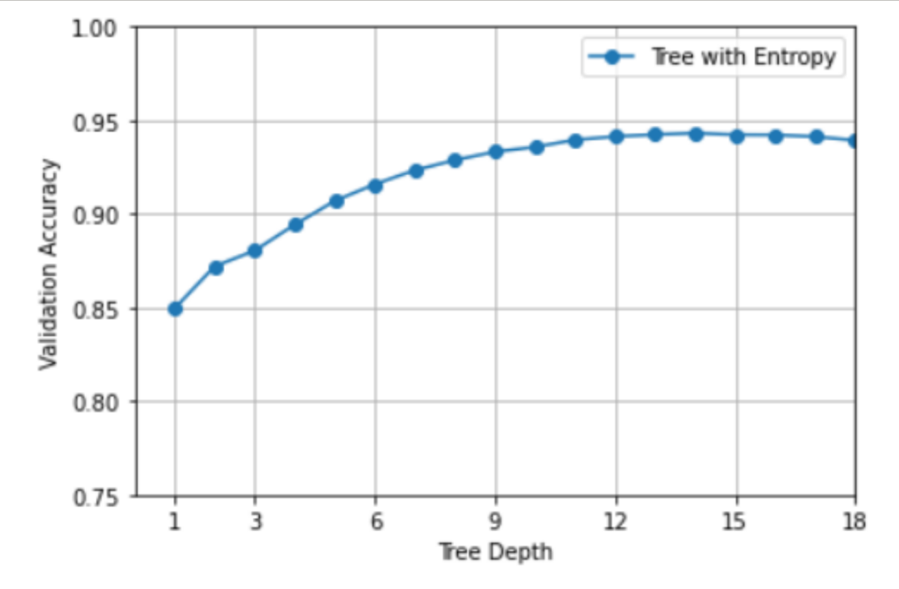
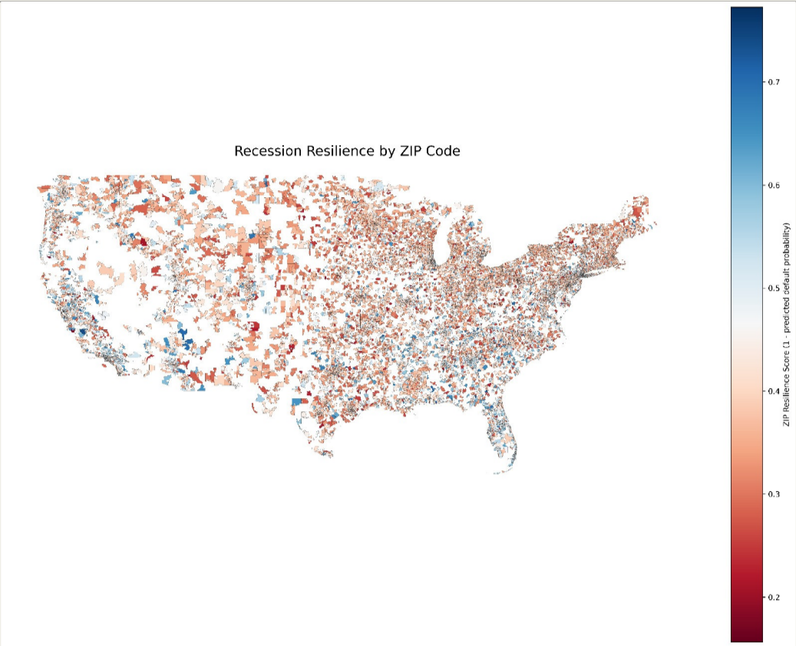
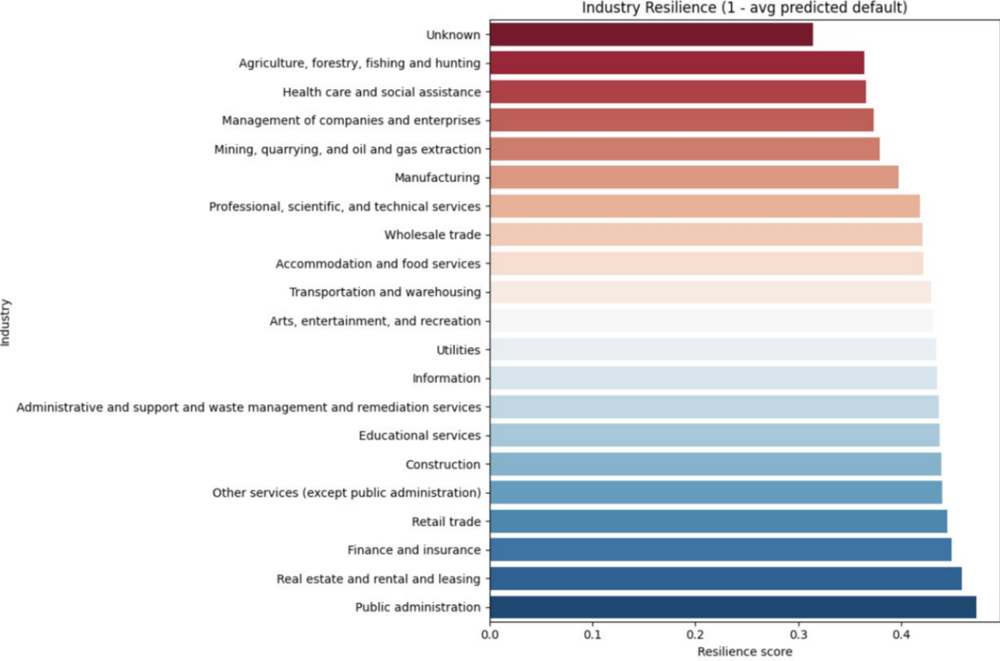

# Small Business Loan Risk Analysis (2008 Recession)

## Project Overview
This project analyzes **SBA loan data** to predict default likelihood during the 2008 financial crisis. By identifying risk patterns across geography, industry, and financial attributes, the study aims to inform lending decisions during economic downturns.

---

## Core Objectives
* **Predictive Modeling:** Classify loans as "Paid in Full" or "Charged Off" (Default).
* **Risk Identification:** Pinpoint key indicators across different industries and US regions.
* **Comparative Analysis:** Evaluate multiple ML architectures to determine the most robust predictor.

---

## Dataset & Pipeline
**Data Source:** SBA Loan Dataset (Kaggle), filtered for the **2007–2012** recessionary period.

### Data Engineering
* **Cleaning:** Standardized missing values and converted monetary fields to numeric types.
* **Encoding:** * *One-Hot Encoding* for Logistic Regression.
    * *Label Encoding* for tree-based models.
* **Feature Engineering:** Extracted industry categories via **NAICS codes** and derived features like SBA guaranteed payout.
* **Data Split:** 70% Training | 15% Validation | 15% Testing.

---

## Model Comparison & Performance

| Model | Key Metrics | Notes |
| :--- | :--- | :--- |
| **Logistic Regression** | ROC-AUC: 0.859 | Served as a strong linear baseline. |
| **Decision Trees** | Variable Depth (1-18) | Optimized for bias/variance tradeoff. |
| **AdaBoost (Final)** | **86% Precision / 83% Recall** | Chosen for superior generalization and lower variance. |

---

## Key Results & Insights

### Geographic Trends
We developed a ZIP-code-level **Recession Resilience Map** for the continental United States.
* **Findings:** Urban areas demonstrated significantly higher resilience than rural regions.
* **Visualization Logic:** Blue indicates high resilience; Red indicates high vulnerability (areas with <20 loans were excluded).

### Industry Resilience
Resilience was calculated as:
$$Resilience = 1 - \text{Average Predicted Default Probability}$$

| **High Resilience Sectors** | **Low Resilience Sectors** |
| :--- | :--- |
| Public Administration | Agriculture & Forestry |
| Real Estate & Leasing | Mining & Oil/Gas Extraction |
| Finance & Insurance | Manufacturing |

---

## Project Visuals

### Validation Accuracy by Tree Depth
This plot shows how validation accuracy changed as decision tree depth increased. Performance improved with depth, then began to plateau, which helped guide hyperparameter selection and avoid unnecessary model complexity.

### Recession Resilience by ZIP Code
This map visualizes resilience across ZIP codes in the continental United States using the score:

`1 - predicted default probability`

Blue indicates more resilient regions, while red indicates less resilient ones.

### Industry Resilience Ranking
This chart ranks industries by their average resilience score, helping compare which sectors appeared stronger or weaker during the recession period.

## Tech Stack
* **Language:** Python
* **Data Science:** Pandas, NumPy, Scikit-learn
* **Visualization:** Matplotlib, Seaborn

---

**Authors:** Ethan Bell, Elle Robertson, Conor Zhang